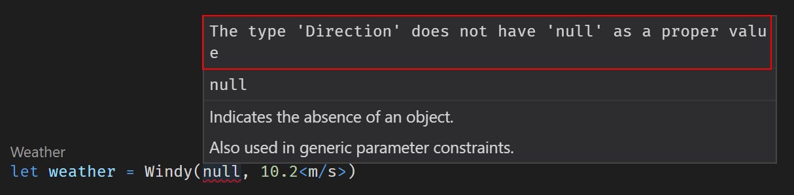
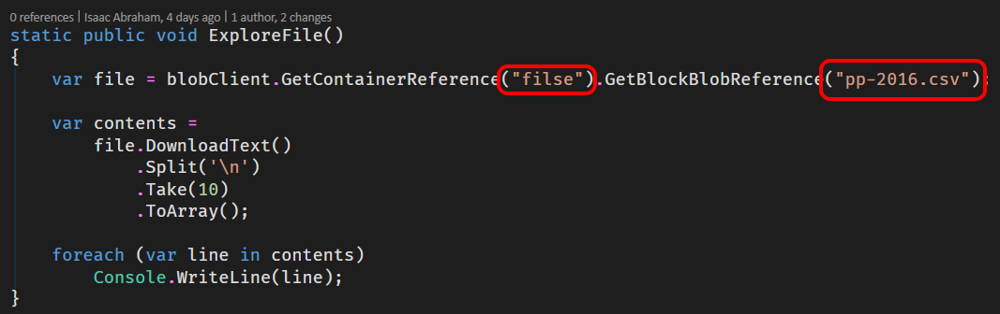
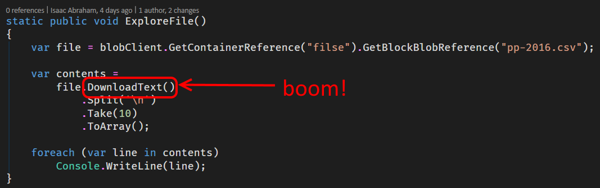

- title : Taming Types in the Cloud
- description : Azure and F# with Type Providers
- author : Isaac Abraham
- theme : sky
- transition : default

*** 

# Taming Types in the Cloud

***

## About me

---

* Working with .NET since 1.0
* Using F# for ~5 years
* Microsoft MVP
* Based in Fulda, Germany (and London, UK)
* Founder of Compositional IT

<br><br><br>

<a href="https://compositional-it.com">
    
</a>

---

### I also make infamous PRs...


---

### What about you?

***


---

* General purpose programming language
* Functional-*first*
* Powerful type system
* Awesome data manipulation capabilities
* Leads to the "pit of success"

---

#### The Mountain of Doom


---

#### The Pit of Success


---

| C# / VB .NET | F#
|-:|:-
| Mutable by default | Immutable by default
| Side-effects + statements | Expressions
| Classes | Functions as values
| Inheritance | Composition
| State | Data + pure functions
| Polymorphism | Algebraic Data Types

---

## F# Primer in < 5 minutes

---

### Values

```fsharp
// bind 5 to x
let x:int = 5

// type inference
let inferredX = 5

// functions are just values, don't need a class
let helloWorld(name) = sprintf "Hello, %s" name 

// type inference again
let text = helloWorld "isaac"
```

---

### Types

```fsharp
open System

// Tuples are first class citizens in F#
let person = Tuple.Create("Isaac", 37)
let personShortHand = "isaac", 37 // string * int
let name, age = personShortHand // decompose the tuple 

// Declaring a record
type Person = { Name : string; Age : int }

// Create an instance
let me = { Name = "Isaac"; Age = 37 }
printfn "%s is %d years old" me.Name me.Age
```
---

### More Types

```fsharp
open FSharp.Data.UnitSystems.SI.UnitSymbols

type Direction = North | South | East | West
type Weather =
    | Cold of temperature:float<C>
    | Sunny
    | Wet
    | Windy of Direction * windspeed:float<m/s>

// Create a weather value
let weather = Windy(North, 10.2<m/s>)

let (|Low|Medium|High|) speed =
    if speed > 10.<m/s> then High
    elif speed > 5<m/s>. then Medium
    else Low
```
---

### Exhaustive pattern matching

```fsharp
match weather with
| Cold temp when temp < 2.0<C> -> "Really cold!"
| Cold _ | Wet -> "Miserable weather!"
| Sunny -> "Nice weather"
| Windy (North, High) -> "High speed northernly wind!"
| Windy (South, _) -> "Blowing southwards"
| Windy _ -> "It's windy!"
```

---

### Pipelines

*Top ten most most popular counties for house sales*


---

### Asynchronous support

```fsharp
open System
open System.Net

let webPageSize = async {
    use wc = new WebClient()
    let! result = wc.AsyncDownloadString(Uri "http://www.bbc.co.uk")
    return result.Length }
```

---

### No nulls!


---

### ACHTUNG!


---

### Whitespace sensitive 

```fsharp
open System
    
let prettyPrintTime() =
    let time = DateTime.UtcNow
    printfn "It is now %d:%d" time.Hour time.Minute
```
---

### Equals is comparison!

```fsharp
let x = 5
x = 10 // false, COMPARISON!!!
```
---

### Immutable by default

```fsharp
let a = 10
//a <- 20 // not allowed

let mutable y = 10 // need an extra keyword!
y <- 20 // ok 
```

---

### REPL

* Read, Evaluate, Print Loop
* No console applications needed
* Scripts
* Explore domain quickly
* Converts quickly to full-blown assemblies

***


---

* Lower costs
* Reduce cap ex
* "Scale fast, fail fast" etc. 
* Reduce time to market
* Enable distributed applications
* Load balancing
* etc. etc. etc.

---

### Azure and F#?


---

### Azure and F#!


---

### F# runs on .NET!

---

<a href="https://docs.microsoft.com/en-us/dotnet/fsharp/using-fsharp-on-azure/">
    
</a>

---

### Now with VS "cool demo mode" support!


---

| Cloud Applications | F# |
|:---:|:---:|
Stateless | Immutable, Expressions
Data-centric | Pattern Matching, ADTs, TPs
Fault tolerant | Powerful compiler
Asynchronous | async { }
Distributed | cloud { }

***

## Data in Azure

---

### Azure Storage


---

### SQL Azure


---

### And others...

* Cosmos DB
* Redis Cache
* Data Lake
* etc. etc.

---

### The cost of Azure data services


---

### Comparing SQL and Storage

| | SQL Azure | Azure Storage |
|---:|:---:|:---:|
| **Cost** | High | Low |
| **Compute** | Powerful | Dumb |
| **Scalability** | Manual | Automatic |

---

### Compute on Azure data services

| | SQL | Tables | Blobs
---:|:---:|:---:|:---:| 
**Projection** | Yes | Yes | No
**Filters** | Yes | *Limited* | No
**Joins** | Yes | *No* | No
**Relationships** | Yes | *No* | No
**Indexes** | Yes | *Limited* | Limited

---

### Working with SQL Azure

* *Table*-level schema
* Relatively rich type system

Customer Id | Name | Order Count | Balance
| --- | --- | --- | ---|
| *guid* | *string 50 null* | *int* | *decimal* |
| 2542685a-... | Joe Bloggs | 23 | 126.23
| bcf678fb-... | Sally Smith | 12 | 59.10
| ad081c1b-... | ***{null}*** | 17 | 89.23

---

### Working with Azure Tables

* *Row*-level schema
* No max length etc.
* All columns are nullable

| Customer Id | Name | Order Count | Balance |
| --- | --- | --- | --- |
| 2542685a-... | Joe Bloggs | 23 | ***{N/A}***
| **123** | Sally Smith | 12 | 59.10
| ad081c1b-... | ***{N/A}*** | 17 | 89.23

---

### Blob Type System

* *No* entity schema
* No notion of rows or columns
* Data stored as raw documents in a path *e.g.*

<br>
<br>

```json
        { "customerId" : "2542685a-",
          "name" : "Joe Bloggs",
          "orderCount" : 23 }
```

***

## DEVELOPERS!


---

## Working with the Azure Storage SDK

---

### Typical challenges

---

### 1. Data Exploration

*List all containers and blobs in my storage account*

---


---


---

#### Inefficient
#### Slow feedback loop
#### Use an external tool?

---

### 2. Mismatched types

*Show me the first 10 rows in the Transactions table*

---

#### Use an external tool to look at the data


---

#### Create a C# type to match


---

#### Write a query


---

#### Oops - wrong property name!


---

#### No runtime error


#### Just bad data

---

### 3. "Sometimes" missing data

*Find all properties where Locality ends in "BOROUGH"*

---

#### Are these columns the same type?


---


---

#### Runtime error


#### Depending on the row you read

---

### 4. Stringly typed data

*Read the first ten lines of the blob `files/pp-2017.csv`*

---

#### Read blob into memory


#### To do cool stuff

---

#### Misspelled container and blob names?



---

#### Runtime error...


---

#### ...in the "wrong" place



---

### 5. "Unusual" API design

---

#### Two ways to create a query?


---

#### Make sure you pick the "good" one!


---


---


---

### 6. Impedence mismatch

---

#### The Azure SDK supports LINQ!


---

#### .....


---

#### Make sure you only use the bits that work...


---


---

## Question:
## How can F# improve this?

---

### 1. F# language features
### 2. The Azure Storage Type Provider

---

[](http://fsprojects.github.io/AzureStorageTypeProvider/)

---


---

# DEMOS!!

---

### F# + Type Provider + Azure = Happiness

| | Before | After
|-|:-:|:-:|
| **Missing data** | Null | Option<T> |
| **Error Handling** | Runtime | Compile Time |
| **Remote resources** | Stringly typed | Strongly typed |
| **Schema** | Manual | Provided |
| **Compile-time Queries** | Unsafe | Safe |

***

### Applications of Storage Type Provider

* Application code for Tables
* Exploration of data
    * Log tables
    * Metrics
    * Exploring "heads" of blobs
    * Exploring unseen tables
* Working with "well-know" blob schemas
* Can always "fall back" to standard Azure SDK

---

## Storage Accounts cost money!

* **Every** query costs
    * **Every** time you dot into something, it costs!
* Use schema files to specify your types
    * Or use preset "dummy data" to guide provided types
* Use the Storage Emulator
    * Repoint to live storage account at runtime

---

## Developing Type Providers

* It's a pain
* It's a REAL pain
* Debugging is next to impossible
* Running 2 IDEs side-by-side
* Slow to develop
* Dependencies are difficult to work with
* .NET Core compatibility **very close**!

---

## Build and CI


---

## Building and Testing

* Tests = compiles :)
    * Need to have the emulator running locally!
* Suite of integration tests on CI
* Appveyor for build
    * Appveyor supports Azure Storage Emulator :)

---

## Shameless plug alert!

<a href="https://www.manning.com/books/get-programming-with-f-sharp">
    
</a>

***

## Thank you!

<a href="https://compositional-it.com">
    
</a>

https://compositional-it.com

[@isaac_abraham](http://twitter.com/isaac_abraham)

[isaac@compositional-it.com](mailto:isaac@compositional-it.com)
